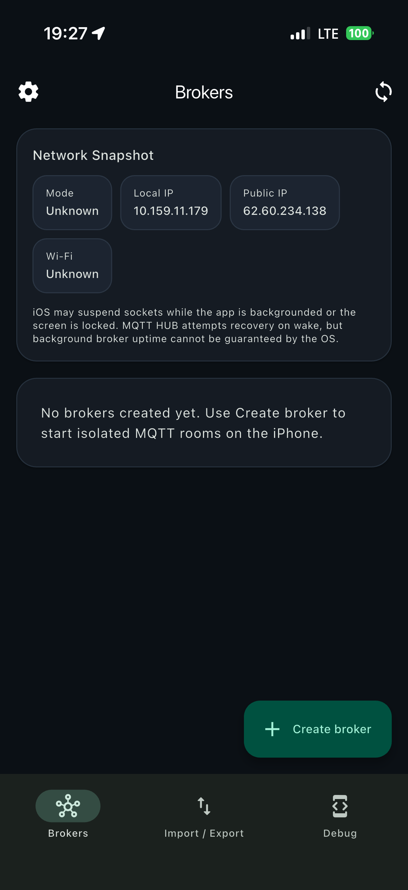
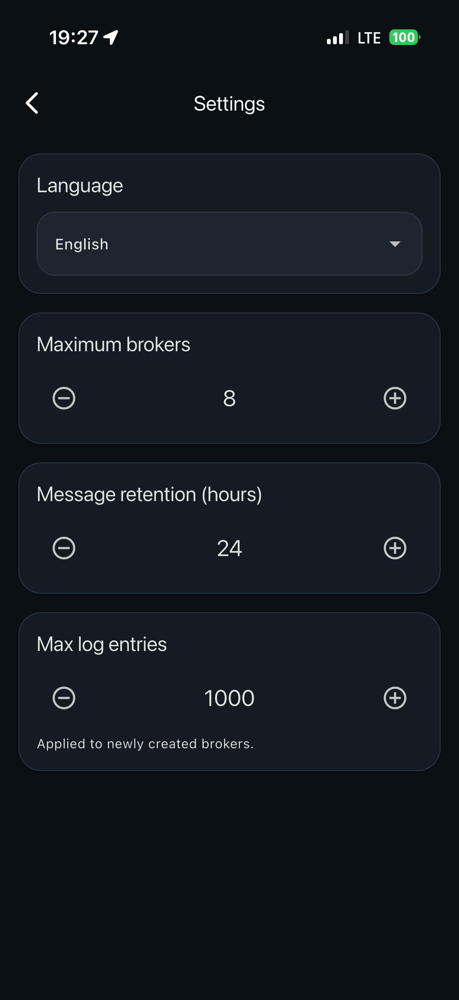
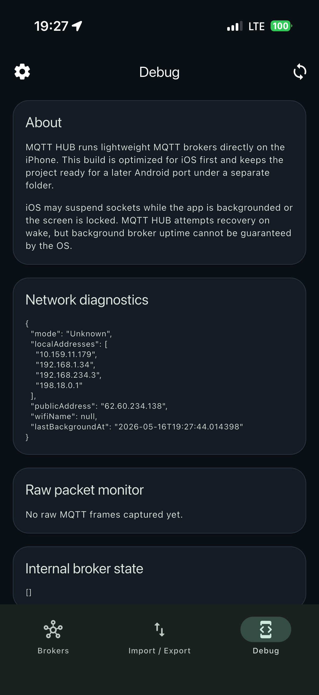
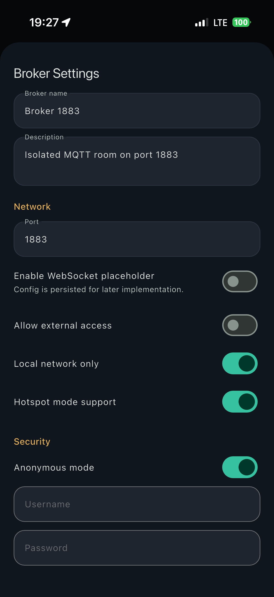
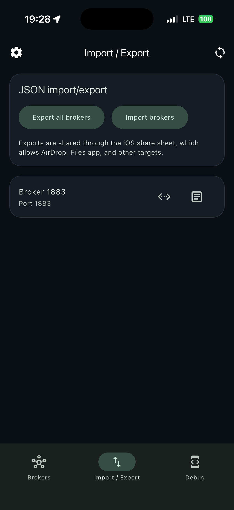

# PHONE BROKER for iPhone (MQTT Broker on Device)

[](https://github.com/Developer-RU/PHONE-BROKER/releases)
[](https://github.com/Developer-RU/PHONE-BROKER/blob/main/LICENSE)
[](https://developer.apple.com/ios/)
[](https://flutter.dev)

PHONE BROKER is a full-featured iOS application that allows you to run lightweight MQTT brokers directly on iPhone.

The project is distributed as a free open-source solution: you can inspect the source code, verify behavior, adapt the UI/UX, and use it in your own workflows.

## Table of Contents

- [Screenshots](#screenshots)
- [Why This Project Exists](#why-this-project-exists)
- [Core Capabilities](#core-capabilities)
- [Typical Use Cases](#typical-use-cases)
- [Technology Stack](#technology-stack)
- [Project Layout](#project-layout)
- [Requirements](#requirements)
- [Quick Start](#quick-start)
- [Running in Xcode (Recommended for iOS)](#running-in-xcode-recommended-for-ios)
- [Running from CLI](#running-from-cli)
- [Build Commands](#build-commands)
- [Installing to Personal Devices](#installing-to-personal-devices)
- [Notes About Wireless Debugging](#notes-about-wireless-debugging)
- [App Stability Notes](#app-stability-notes)
- [Functional Scope and Limits](#functional-scope-and-limits)
- [Customization and Redesign](#customization-and-redesign)
- [Quality and Verification](#quality-and-verification)
- [Troubleshooting](#troubleshooting)
- [License](#license)
- [Community and Support](#community-and-support)

## Screenshots

<p align="center">
	
	
	
	
	
</p>

## Why This Project Exists

Many teams, engineers, and IoT enthusiasts need a quick local MQTT endpoint for testing, demos, diagnostics, and offline development.

PHONE BROKER solves this with one device:

- No dedicated server is required for local scenarios.
- No cloud subscription is required for basic local broker tasks.
- No hidden runtime lock-in.

You can emulate and test MQTT server behavior in a local network using only your phone.

## Core Capabilities

- Create and run multiple MQTT broker configurations on iPhone.
- Start, stop, restart, duplicate, and delete brokers.
- Use independent ports for each broker.
- Monitor status and runtime diagnostics.
- View live broker logs and system logs.
- Import and export broker configurations (JSON workflows).
- Configure language and app-level settings.
- Use network diagnostics views for local troubleshooting.

## Typical Use Cases

- Rapid IoT prototyping in a home/lab network.
- QA testing for MQTT clients without external infrastructure.
- Demo environments for local device communication.
- Educational labs for MQTT protocol basics.
- Temporary local broker endpoint while traveling/offline.

## Technology Stack

- Flutter + Dart
- iOS host project via Xcode
- SQLite storage (`sqflite`)
- State management with `provider`
- CocoaPods for iOS native dependencies

## Project Layout

- `ios/` (this folder): iOS host app project for Xcode.
- `Runner.xcworkspace`: open this file for iOS builds and deployment.
- `Runner.xcodeproj`: do not use directly when CocoaPods is enabled.
- `../lib/`: Flutter application source code.
- `../assets/`: app icons and visual assets.

## Requirements

Before building, install:

1. macOS (recommended current stable release)
2. Xcode (latest stable version)
3. Flutter SDK (stable channel)
4. CocoaPods (`pod` command available)
5. iPhone (optional, for real-device deployment)

## Quick Start

If you want to run the app quickly on iOS, use this minimal flow from project root:

```bash
flutter pub get
cd ios
pod install
cd ..
flutter run -d <device_id>
```

## Initial Setup

Run from project root (`ios_app`):

```bash
flutter pub get
cd ios
pod install
cd ..
```

## Running in Xcode (Recommended for iOS)

1. Open `ios/Runner.xcworkspace` in Xcode.
2. Select target `Runner`.
3. Open `Signing & Capabilities`.
4. Choose your Apple Team.
5. Select a device (simulator or physical iPhone).
6. Run with `Product -> Run`.

## Running from CLI

From `ios_app` root:

```bash
flutter run -d <device_id>
```

For profile build:

```bash
flutter run --profile -d <device_id>
```

For release build:

```bash
flutter run --release -d <device_id>
```

## Build Commands

Debug build without signing:

```bash
flutter build ios --debug --no-codesign
```

Release build (signed by Xcode team settings):

```bash
flutter build ios --release
```

## Installing to Personal Devices

1. Connect iPhone by USB for first deployment.
2. Trust computer on device if prompted.
3. Enable Developer Mode on iPhone.
4. In Xcode, select your Team and bundle signing.
5. Deploy from Xcode or Flutter CLI.

If iOS shows untrusted developer warning:

1. iPhone Settings -> General -> VPN & Device Management
2. Select your developer profile
3. Tap Trust

## Notes About Wireless Debugging

- Wireless deployment can be unstable on newer iOS versions.
- If connection drops, use USB + Xcode `Product -> Run`.
- App launch can still succeed even if Flutter VM service disconnects.

## App Stability Notes

The project includes startup protections for repeated launches:

- Bootstrap timeout protection
- SQLite open timeout and recovery path
- Graceful lifecycle recovery handling

These safeguards reduce startup hangs after force-close and relaunch.

## Functional Scope and Limits

- Designed for local and edge scenarios.
- iOS may suspend sockets in background/locked state.
- Continuous background uptime is constrained by iOS policy.

## Customization and Redesign

You can modify the project freely:

- UI and brand style
- localization and text
- broker defaults
- diagnostics and logging behavior

Source is provided so you can verify exactly how the app works and adapt it for your own use.

## Quality and Verification

Run static checks:

```bash
flutter analyze
```

Recommended manual checks:

1. Create broker
2. Start broker
3. Connect local MQTT client
4. Publish/subscribe test
5. Force-close app and relaunch
6. Verify logs and broker recovery behavior

## Troubleshooting

If the app does not start on iOS after dependency changes:

```bash
flutter clean
flutter pub get
cd ios
pod deintegrate
pod install
cd ..
flutter run -d <device_id>
```

If Flutter reports VM service disconnect during launch, verify whether the app actually opened on device. On iOS, transport disconnect and runtime crash are not always the same event.

For signing issues, open `ios/Runner.xcworkspace` in Xcode and confirm Team, Bundle Identifier, and provisioning profile.

## License

This project is licensed under the MIT License. See [LICENSE](LICENSE).

## Community and Support

If this project helps your work:

- Share feedback and bug reports
- Leave comments and suggestions
- Support development with stars, likes, and donations

This project is built for real-world use by developers and IoT practitioners who need a reliable, free, and transparent local MQTT broker solution on iPhone.
